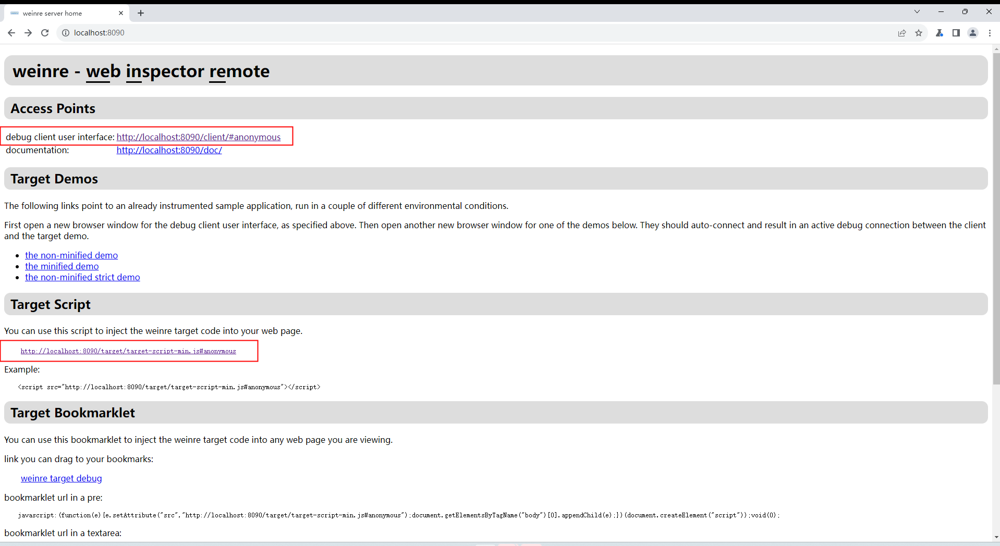
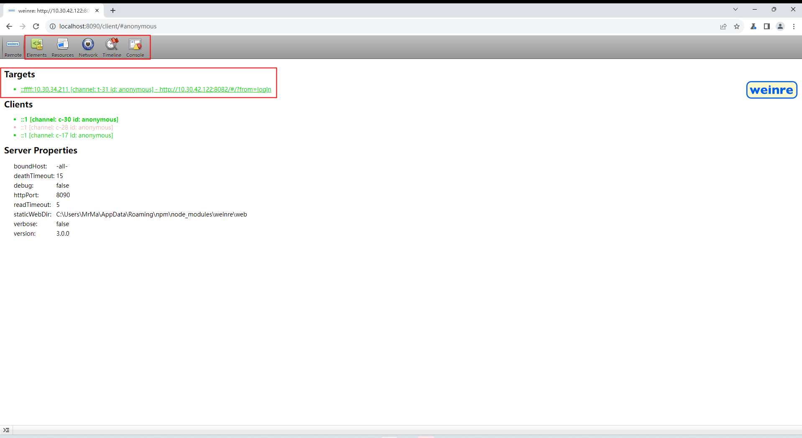

weinre 是一款用 JS 实现的基于 Web Inspector 的远程调试工具，全称为 Web Inspector Remote。下面是它的基本使用教程。

### 第一步：下载安装

确保有 Node 运行环境的情况下执行安装命令：

```shell
$ npm install -g weinre
```

### 第二步：运行 weinre

weinre 默认绑定的域名及端口为：localhost:8080，这样并不能远程调试手机上的 H5 页面，所以在运行时应该取消域名限制，并修改端口号（8080 容易发生冲突）：

```shell
$ weinre --httpPort 8090 --boundHost -all-
```

运行起来以后，就可以在浏览器中输入网址 http://localhost:8090 打开调试工具界面了：



### 第三步：执行调试

在上一步的调试工具界面中，可以看到圈中的两个地方，一个是调试界面入口，一个是需要嵌入到要调试的 H5 页面中的一个 js 脚本（该脚本用于调试网络通信）。

==需要注意的是，嵌入的 js 脚本地址中的域名需要改为 ip 地址，因为页面是运行在手机端的（同网段可访问电脑端本地服务）。==假如是一个 Vue 项目，只需要把该脚本地址嵌入 `/public/index.html` 文件即可：

```html
<script src="http://10.30.42.122:8090/target/target-script-min.js#anonymous"></script>
```

接下来只需要点击 weinre 指定的调试界面入口（debug client user interface）即可进入调试界面，像下面这样：



可以看到调试界面第一个选项中展示了访问该调试页面的所有客户端访问信息，其余选项就类似于电脑端浏览器开发者工具那样，可以查看页面的 HTML 结构、网络请求及控制台信息等。

至此，就可以愉快地进行远程真机调试手机中的 H5 页面了:happy:，想要深入了解 weinre 的话可以查看【参考资料】部分中的进阶文章。

### 参考资料

- [初识Weinre](https://www.bookstack.cn/read/Weinre/README.md)
- [Weinre进阶](https://www.bookstack.cn/read/Weinre/chapter2.md)