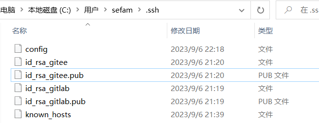

- [本地配置多个git账户（公司、GitHub）_git 项目账号覆盖全局账号_西木鹿亚的博客-CSDN博客](https://blog.csdn.net/qq_33866817/article/details/120847864)

第一步：假如需要本地有两个 Git 账户分别关联到 Gitlab 和 Gitee 的仓库，先使用 ssh-keygen 命令行工具生成两对密钥，生成到用户目录下的 .ssh 目录中：

```shell
ssh-keygen -C "sefama@126.com" -f ~/.ssh/id_rsa_gitlab
ssh-keygen -C "mrma2022@126.com" -f ~/.ssh/id_rsa_gitee
```



第二步：可以看到上图中新增了一个 config 文件，这是配置多账户关联多仓库的核心配置文件，Git 在操作远程仓库时会自动读取该配置文件，其配置内容如下所示（注意：每个 Git 托管平台主机对应着一对密钥）：

```shell
Host gitlab.com	# 主机别名，最好和主机域名一致就行
HostName 域名	# 也可以是 ip
IdentityFile C:\Users\sefam\.ssh\id_rsa_gitlab	# 私钥文件地址
PreferredAuthentications publickey
User 马先锋 # 用户名

Host gitee.com
HostName gitee.com
IdentityFile C:\Users\sefam\.ssh\id_rsa_gitee
PreferredAuthentications publickey
User MrMa
```

第三步：将配置文件中各个私钥对应的公钥文件内容分别复制到对应的 Git 托管平台 SSH 公钥列表中（略过）。配置完成后可以通过以下命令进行 ssh 连接尝试（注意调用主机别名的方式）：

```shell
ssh -T git@gitee.com
```

> [!NOTE] 提示
> 在新增 Git 平台使用的密钥对之后，配置 config 文件之前，如果想要尝试连接 Git 平台则必须通过<font color="#ff0000">给命令添加 `-i` 选项指定私钥文件</font>，否则 ssh 不知道你想要尝试连接哪一个 Git 平台进而提示权限不通过。
```
> ssh -T git@gitee.com -i ~/.ssh/id_rsa_gitee
```

第四步：项目目录中在关联远程仓库时使用配置文件中对应主机的别名进行关联（注意主机别名调用方式与仓库指定方式）：

```shell
git remote add origin git@gitee.com:sefama/laravel-study.git
```

最终就可以单独关联和操作 Gitee 远程仓库了，<font color="red">而且如果另外一个项目一直在使用 HTTP 协议关联操作另外一个远程仓库的话，是不需要使用 SSH 重新关联的，还按照 HTTP 地址进行代码获取和推送即可（也不需要在 config 配置文件中体现）！</font>